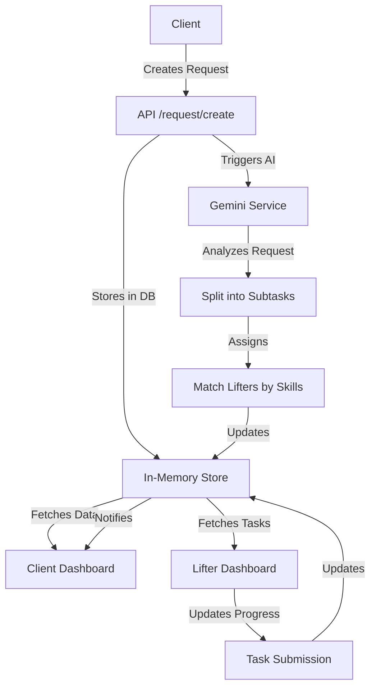
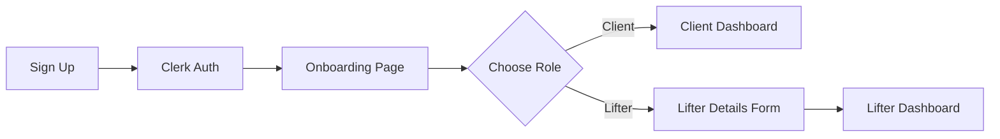

# KaamSetu 🚀

**COMPLETELY VIBE CODED**

**Your Bridge to Smart Work** - An AI-powered work management platform that connects clients with top-tier "Lifters" using Gemini AI to intelligently split and assign tasks.


---

## 📋 Table of Contents

- [Overview](#overview)
- [Tech Stack](#tech-stack)
- [Architecture](#architecture)
- [Installation](#installation)
- [Environment Variables](#environment-variables)
- [API Endpoints](#api-endpoints)
- [Database Schema](#database-schema)
- [Authentication Flow](#authentication-flow)
- [How It Works](#how-it-works)
- [Features](#features)
- [Deployment](#deployment)

---

## 🎯 Overview

KaamSetu is a modern work marketplace that leverages AI to streamline project management. Clients can post work requests, which are automatically analyzed and broken down into manageable subtasks by Gemini AI. These tasks are then intelligently assigned to skilled workers called "Lifters" based on their expertise and performance rankings.

### Key Highlights

- **AI-Powered Task Splitting**: Gemini AI analyzes requests and creates optimized subtask breakdowns
- **Smart Matching**: Automatic lifter assignment based on skills and performance history
- **Real-time Progress Tracking**: Monitor task progress with live updates
- **Ranking System**: Lifters earn ranks based on completed tasks and performance
- **Dual Dashboards**: Separate interfaces for clients and lifters
- **Secure Authentication**: Powered by Clerk for seamless sign-in/sign-up

---

## 🛠 Tech Stack

### Frontend

| Technology | Version | Purpose |
|------------|---------|---------|
| **Next.js** | 16.0.3 | React framework with App Router, server components, and API routes |
| **React** | 19.2.0 | UI library with latest concurrent features |
| **TypeScript** | 5.x | Type-safe development |
| **Tailwind CSS** | 4.x | Utility-first CSS framework |
| **Radix UI** | Latest | Accessible, unstyled UI components |
| **Lucide React** | 0.554.0 | Beautiful, consistent icon library |
| **next-themes** | 0.4.6 | Dark mode support with theme switching |

### Authentication & Authorization

| Technology | Version | Purpose |
|------------|---------|---------|
| **Clerk** | 6.35.2 | Complete authentication solution (Google OAuth, email/password) |

### Utilities

| Technology | Version | Purpose |
|------------|---------|---------|
| **date-fns** | 4.1.0 | Date formatting and manipulation |
| **clsx** | 2.1.1 | Conditional className utility |
| **tailwind-merge** | 3.4.0 | Merge Tailwind classes without conflicts |
| **class-variance-authority** | 0.7.1 | Type-safe component variants |

### UI Components

- **@radix-ui/react-avatar** - User avatars
- **@radix-ui/react-dialog** - Modal dialogs
- **@radix-ui/react-dropdown-menu** - Dropdown menus
- **@radix-ui/react-select** - Select inputs
- **@radix-ui/react-tabs** - Tab navigation
- **@radix-ui/react-scroll-area** - Custom scrollbars
- **react-day-picker** - Date picker component

### Dev Tools

| Technology | Version | Purpose |
|------------|---------|---------|
| **ESLint** | 9.x | Code linting |
| **babel-plugin-react-compiler** | 1.0.0 | React compiler for optimizations |
| **tw-animate-css** | 1.4.0 | Animation utilities for Tailwind |

---

## 🏗 Architecture

### Project Structure

```
slack-clone/
├── src/
│   ├── app/                    # Next.js App Router
│   │   ├── api/               # API Routes
│   │   │   ├── request/       # Request management endpoints
│   │   │   │   ├── create/    # Create new request
│   │   │   │   ├── list/      # List requests by client
│   │   │   │   └── [id]/      # Get specific request
│   │   │   └── user/          # User management endpoints
│   │   │       ├── create/    # Create new user
│   │   │       └── me/        # Get current user
│   │   ├── client/            # Client Dashboard
│   │   │   ├── dashboard/     # Main client view
│   │   │   ├── request/       # Request creation/management
│   │   │   └── checkout/      # Payment flow
│   │   ├── lifter/            # Lifter Dashboard
│   │   │   ├── dashboard/     # Main lifter view
│   │   │   └── settings/      # Lifter settings & withdrawal
│   │   ├── onboarding/        # User role selection & setup
│   │   ├── chat/              # Request chat & collaboration
│   │   ├── sign-in/           # Sign in page
│   │   ├── sign-up/           # Sign up page
│   │   ├── page.tsx           # Landing page
│   │   ├── layout.tsx         # Root layout with providers
│   │   └── globals.css        # Global styles & theme
│   ├── components/            # Reusable components
│   │   ├── ui/               # shadcn/ui components
│   │   ├── mode-toggle.tsx   # Theme switcher
│   │   ├── role-guard.tsx    # Role-based access control
│   │   ├── task-submission.tsx # Task submission component
│   │   └── theme-provider.tsx  # Theme context provider
│   ├── lib/                   # Utility libraries
│   │   ├── store.ts          # In-memory data store
│   │   ├── gemini-service.ts # Mock AI service
│   │   └── utils.ts          # Helper functions
│   └── middleware.ts          # Clerk authentication middleware
├── public/                    # Static assets
├── package.json              # Dependencies
├── tsconfig.json             # TypeScript configuration
├── tailwind.config.js        # Tailwind configuration
└── next.config.ts            # Next.js configuration
```

### Data Flow



---

## 📦 Installation

### Prerequisites

- **Node.js** 20+ (recommended: use the latest LTS version)
- **npm**, **yarn**, **pnpm**, or **bun** package manager
- **Clerk Account** for authentication setup

### Step-by-Step Setup

1. **Clone the repository**

```bash
git clone <repository-url>
cd slack-clone
```

2. **Install dependencies**

```bash
npm install
# or
yarn install
# or
pnpm install
# or
bun install
```

3. **Set up environment variables**

Create a `.env.local` file in the root directory (see [Environment Variables](#environment-variables) section below)

4. **Run the development server**

```bash
npm run dev
# or
yarn dev
# or
pnpm dev
# or
bun dev
```

5. **Open your browser**

Navigate to [http://localhost:3000](http://localhost:3000) to see the application.

---

## 🔐 Environment Variables

Create a `.env.local` file in the root directory with the following variables:

```env
# Clerk Authentication
# Get these from https://dashboard.clerk.com/
NEXT_PUBLIC_CLERK_PUBLISHABLE_KEY=pk_test_xxxxxxxxxxxxxxxxxxxxxxxxxxxxxxxxxxxxxxxxxxxxx
CLERK_SECRET_KEY=sk_test_xxxxxxxxxxxxxxxxxxxxxxxxxxxxxxxxxxxxxxxxxxxxx

# Clerk URLs (optional - defaults shown below)
NEXT_PUBLIC_CLERK_SIGN_IN_URL=/sign-in
NEXT_PUBLIC_CLERK_SIGN_UP_URL=/sign-up
NEXT_PUBLIC_CLERK_AFTER_SIGN_IN_URL=/onboarding
NEXT_PUBLIC_CLERK_AFTER_SIGN_UP_URL=/onboarding
```

### Getting Clerk Keys

1. Create a free account at [Clerk](https://clerk.com/)
2. Create a new application
3. Go to **API Keys** in the dashboard
4. Copy your **Publishable Key** and **Secret Key**
5. Enable **Google OAuth** in the authentication settings (optional but recommended)

---

## 🔌 API Endpoints

### User Endpoints

#### **POST** `/api/user/create`

Create a new user in the system after Clerk authentication.

**Request Body:**
```json
{
  "id": "user_clerk_id_123",
  "email": "john@example.com",
  "name": "John Doe",
  "role": "client",  // or "lifter"
  "phone": "+1234567890",  // Required for lifters
  "skills": ["Video Editing", "Python", "React"]  // Required for lifters
}
```

**Response (200 OK):**
```json
{
  "success": true,
  "user": {
    "id": "user_clerk_id_123",
    "email": "john@example.com",
    "name": "John Doe",
    "role": "client",
    "balance": 0
  }
}
```

**Response (500 Error):**
```json
{
  "success": false,
  "error": "Failed to create user"
}
```

---

#### **GET** `/api/user/me`

Get the currently authenticated user's profile.

**Headers:**
- Requires Clerk session cookie (automatic with Clerk middleware)

**Response (200 OK):**
```json
{
  "user": {
    "id": "user_clerk_id_123",
    "email": "john@example.com",
    "name": "John Doe",
    "role": "lifter",
    "phone": "+1234567890",
    "skills": ["Video Editing", "Python"],
    "rank": 45,
    "balance": 1250,
    "resumeUrl": "mock-resume.pdf"
  }
}
```

**Response (401 Unauthorized):**
```json
{
  "error": "Unauthorized"
}
```

**Response (200 OK - User Not Found):**
```json
{
  "user": null
}
```

---

### Request Endpoints

#### **POST** `/api/request/create`

Create a new work request. The request is automatically processed by Gemini AI to split into subtasks and assign lifters.

**Request Body:**
```json
{
  "clientId": "user_clerk_id_123",
  "description": "Create a promotional video for my new app with editing and sound design",
  "deadline": "2024-12-31T23:59:59Z",
  "budget": 500
}
```

**Response (200 OK):**
```json
{
  "success": true,
  "request": {
    "id": "req_abc123xyz",
    "clientId": "user_clerk_id_123",
    "description": "Create a promotional video for my new app with editing and sound design",
    "deadline": "2024-12-31T23:59:59Z",
    "status": "in-progress",
    "budget": 500,
    "subtasks": [
      {
        "id": "task_1",
        "requestId": "req_abc123xyz",
        "description": "Write script and storyboard",
        "assignedLifterId": "lifter_456",
        "status": "pending",
        "progress": 0
      },
      {
        "id": "task_2",
        "requestId": "req_abc123xyz",
        "description": "Video editing and assembly",
        "assignedLifterId": "lifter_789",
        "status": "pending",
        "progress": 0
      },
      {
        "id": "task_3",
        "requestId": "req_abc123xyz",
        "description": "Sound design and mixing",
        "assignedLifterId": "lifter_456",
        "status": "pending",
        "progress": 0
      },
      {
        "id": "task_4",
        "requestId": "req_abc123xyz",
        "description": "Thumbnail design",
        "assignedLifterId": "lifter_789",
        "status": "pending",
        "progress": 0
      }
    ]
  }
}
```

**Response (500 Error):**
```json
{
  "success": false,
  "error": "Failed to create request"
}
```

**Processing Flow:**
1. Request is created with status `"processing"`
2. Gemini AI analyzes the description and splits it into subtasks
3. Lifters are automatically assigned based on skills
4. Status changes to `"in-progress"`
5. Response includes complete request with assigned subtasks

---

#### **GET** `/api/request/list?clientId={userId}`

Get all requests created by a specific client.

**Query Parameters:**
- `clientId` (required): The Clerk user ID of the client

**Example:**
```
GET /api/request/list?clientId=user_clerk_id_123
```

**Response (200 OK):**
```json
{
  "requests": [
    {
      "id": "req_abc123xyz",
      "clientId": "user_clerk_id_123",
      "description": "Create a promotional video",
      "deadline": "2024-12-31T23:59:59Z",
      "status": "in-progress",
      "budget": 500,
      "subtasks": [...]
    },
    {
      "id": "req_def456uvw",
      "clientId": "user_clerk_id_123",
      "description": "Build a landing page",
      "deadline": "2024-11-30T23:59:59Z",
      "status": "completed",
      "budget": 300,
      "subtasks": [...]
    }
  ]
}
```

**Response (400 Bad Request):**
```json
{
  "error": "Client ID is required"
}
```

---

#### **GET** `/api/request/{id}`

Get details of a specific request by ID.

**Path Parameters:**
- `id`: The request ID

**Example:**
```
GET /api/request/req_abc123xyz
```

**Response (200 OK):**
```json
{
  "request": {
    "id": "req_abc123xyz",
    "clientId": "user_clerk_id_123",
    "description": "Create a promotional video",
    "deadline": "2024-12-31T23:59:59Z",
    "status": "in-progress",
    "budget": 500,
    "subtasks": [
      {
        "id": "task_1",
        "requestId": "req_abc123xyz",
        "description": "Write script and storyboard",
        "assignedLifterId": "lifter_456",
        "status": "in-progress",
        "progress": 65
      }
    ]
  }
}
```

**Response (404 Not Found):**
```json
{
  "error": "Request not found"
}
```

---

## 🗄 Database Schema

Currently using an **in-memory store** (resets on server restart). In production, this should be replaced with a real database like PostgreSQL, MongoDB, or Supabase.

### User Model

```typescript
interface User {
  id: string;              // Clerk user ID
  email: string;           // User email
  name: string;            // Full name
  role: 'client' | 'lifter';  // User role
  phone?: string;          // Phone number (required for lifters)
  skills?: string[];       // Skills array (for lifters)
  resumeUrl?: string;      // Resume URL (for lifters)
  rank?: number;           // Performance rank 0-100 (for lifters)
  balance?: number;        // Account balance for withdrawals
  bankDetails?: string;    // Bank information for lifters
}
```

### Request Model

```typescript
interface Request {
  id: string;              // Unique request ID
  clientId: string;        // Client's Clerk user ID
  description: string;     // Work description
  deadline: string;        // ISO 8601 date string
  status: 'pending' | 'processing' | 'in-progress' | 'completed';
  subtasks: Subtask[];     // Array of subtasks
  budget: number;          // Budget in USD
}
```

### Subtask Model

```typescript
interface Subtask {
  id: string;              // Unique subtask ID
  requestId: string;       // Parent request ID
  description: string;     // Task description
  assignedLifterId?: string;  // Assigned lifter's user ID
  status: 'pending' | 'in-progress' | 'completed';
  progress: number;        // Progress percentage 0-100
}
```

### Store Methods

```typescript
class Store {
  // User operations
  addUser(user: User): void
  getUser(id: string): User | undefined
  updateUser(id: string, data: Partial<User>): void
  
  // Request operations
  addRequest(request: Request): void
  getRequest(id: string): Request | undefined
  getRequestsByClient(clientId: string): Request[]
  getAllRequests(): Request[]
  getLifterTasks(lifterId: string): Subtask[]
}
```

---

## 🔒 Authentication Flow

### Powered by Clerk

1. **Public Routes**
   - Landing page (`/`)
   - Sign in page (`/sign-in`)
   - Sign up page (`/sign-up`)

2. **Protected Routes** (require authentication)
   - `/client/*` - Client dashboard and features
   - `/lifter/*` - Lifter dashboard and features
   - `/onboarding` - User role selection
   - `/chat/*` - Request chat

3. **Middleware Implementation**

```typescript
// src/middleware.ts
const isProtectedRoute = createRouteMatcher([
  '/client(.*)',
  '/lifter(.*)',
  '/onboarding(.*)',
  '/chat(.*)'
]);

export default clerkMiddleware(async (auth, req) => {
  if (isProtectedRoute(req)) await auth.protect();
});
```

4. **Sign-in Methods**
   - Google OAuth (Single Sign-On)
   - Email + Password
   - Magic link (email)

5. **Onboarding Flow**



---

## ⚙️ How It Works

### For Clients

1. **Sign Up/Sign In**
   - Create an account or sign in with Google
   - Select "Hire Talent" role during onboarding

2. **Create a Request**
   - Navigate to "New Request"
   - Enter work description, deadline, and budget
   - Submit the request

3. **AI Processing**
   - Gemini AI analyzes the request
   - Automatically splits work into subtasks
   - Matches and assigns skilled lifters

4. **Track Progress**
   - View all requests on the dashboard
   - Monitor subtask progress in real-time
   - Communicate via chat

5. **Payment**
   - Pay upon completion
   - Rate and review lifters

### For Lifters

1. **Sign Up/Sign In**
   - Create an account with Google
   - Select "Work as Lifter" role
   - Complete profile (skills, phone, resume)

2. **Receive Assignments**
   - Gemini AI automatically assigns tasks
   - Based on skills and availability
   - View tasks on the dashboard

3. **Complete Work**
   - Work on assigned subtasks
   - Update progress percentage
   - Submit completed work

4. **Earn & Withdraw**
   - Earn money for completed tasks
   - Build rank based on performance
   - Withdraw earnings to bank account

5. **Ranking System**
   - Start at rank 0
   - Earn +5 points per completed task
   - Higher ranks get priority assignments

### Gemini AI Service

The **mock Gemini AI service** currently uses keyword detection to split tasks:

```typescript
// Example: Video request
Input: "Create a promotional YouTube video with editing and sound"

Output Subtasks:
- Write script and storyboard
- Video editing and assembly
- Sound design and mixing
- Thumbnail design
```

**Keywords Recognized:**
- `video`, `youtube` → Video production tasks
- `website`, `app` → Software development tasks
- Others → Generic research & execution tasks

**In production**, this should integrate with the real **Google Gemini API** for intelligent task analysis.

---

## ✨ Features

### Completed Features

✅ User authentication with Clerk  
✅ Onboarding flow with role selection  
✅ Client dashboard with request management  
✅ Lifter dashboard with task overview  
✅ AI-powered request splitting (mock)  
✅ Automatic lifter assignment  
✅ Progress tracking system  
✅ Ranking system for lifters  
✅ Dark mode support  
✅ Responsive design  
✅ Beautiful UI with Tailwind CSS  

### Planned Features

🔜 Real Gemini API integration  
🔜 Real-time chat between clients and lifters  
🔜 Payment integration (Stripe)  
🔜 File upload & sharing  
🔜 Database integration (PostgreSQL/Supabase)  
🔜 Email notifications  
🔜 Advanced filtering & search  
🔜 Lifter portfolio pages  
🔜 Client review system  
🔜 Admin dashboard  

---

## 🚀 Deployment

### Deploy to Vercel (Recommended)

1. **Push to GitHub**

```bash
git add .
git commit -m "Initial commit"
git push origin main
```

2. **Import to Vercel**
   - Go to [Vercel](https://vercel.com/)
   - Click "Import Project"
   - Select your GitHub repository
   - Configure environment variables (add all `.env.local` vars)
   - Click "Deploy"

3. **Update Clerk Settings**
   - In Clerk dashboard, add your production domain
   - Update authorized origins and redirect URLs

### Deploy to Other Platforms

#### **Netlify**

```bash
npm run build
```

Add build command: `npm run build`  
Publish directory: `.next`

#### **Railway**

```bash
railway login
railway init
railway up
```

Add environment variables in Railway dashboard.

#### **Docker**

```dockerfile
FROM node:20-alpine
WORKDIR /app
COPY package*.json ./
RUN npm install
COPY . .
RUN npm run build
EXPOSE 3000
CMD ["npm", "start"]
```

Build and run:
```bash
docker build -t kaam-setu .
docker run -p 3000:3000 kaam-setu
```

---

## 📝 Scripts

| Command | Description |
|---------|-------------|
| `npm run dev` | Start development server on `localhost:3000` |
| `npm run build` | Build production bundle |
| `npm run start` | Start production server |
| `npm run lint` | Run ESLint for code quality |

---

## 🤝 Contributing

Contributions are welcome! Please follow these steps:

1. Fork the repository
2. Create a feature branch (`git checkout -b feature/amazing-feature`)
3. Commit your changes (`git commit -m 'Add amazing feature'`)
4. Push to the branch (`git push origin feature/amazing-feature`)
5. Open a Pull Request

---

## 📄 License

This project is licensed under the MIT License.

---

## 💬 Support

For questions or issues:
- Open an issue on GitHub
- Contact: support@kaamsetu.com (placeholder)

---

## 🎨 Design Credits

- UI Design: Custom design with inspiration from modern SaaS platforms
- Icons: [Lucide Icons](https://lucide.dev/)
- Fonts: [Geist Sans & Geist Mono](https://vercel.com/font) by Vercel
- Components: [shadcn/ui](https://ui.shadcn.com/) + [Radix UI](https://www.radix-ui.com/)

---

**Built with ❤️ using Next.js and Gemini AI**
